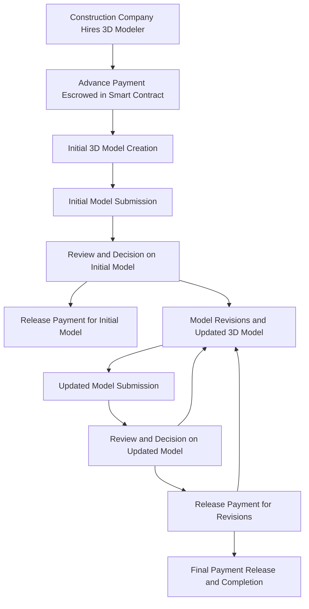
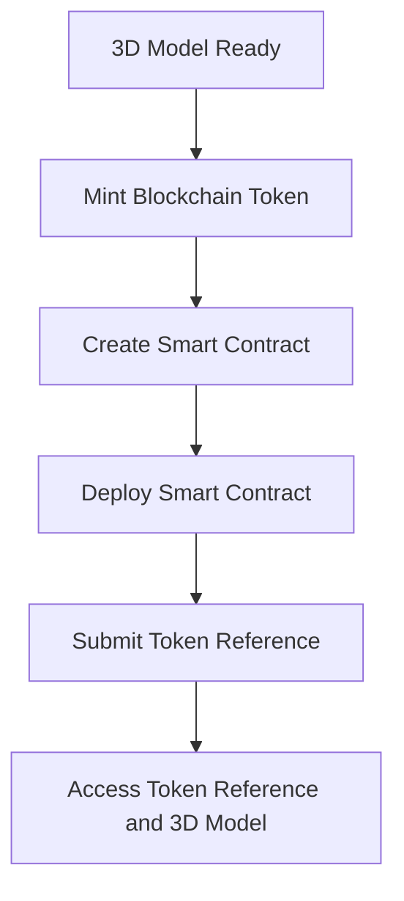
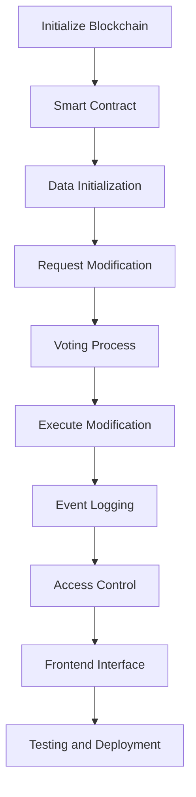

# Current Status (phase2)
- We have a basic UI ready where we can view the 3D model of the construction. Of which we can change the dimensions and see it change actively. Also as an example we have made a bridge under construction, of which we can change the dimensions to see its changes as it is being built. Additionally the number of pillars change as we increase the length of the bridge.

- We are taking inspiration from Cities Skylines and Train Simulator for **generative 3D modelling**.

- With time you can can see different stages of construction, dimensions as in game Cities Skylines.

- **DEM** aka Digital Elevation Model data, route modelling from TS.

- Using blockchain / crypto was not feasible so we opted for UPI payment option, which is much simpler to implement.

- Also we have considered implementing **blockchain** to transfer data of construction elements such that they remain immutable during the transaction from one party to another or unless voted out by the stakeholders to withhold the transaction.

- Using blockchain we can more easily involve the stakeholders to approve or reject payment transactions when the work is adequately completed.

- Due to non availability of relevant equipment and software we could not work on the generative modelling concept.

# Current Status (phase3)
- We have added the blockchain transaction functionality to transact the 3D model files.
- We have designed the blockchain algorithms, test cases and constraints to increase the security and immutability of the design files
-we have integrated the smartcontract.
-Also researched about the different areas related to this field where this technology can be implemented.
  

# Flowcharts
## 3D Modelling of an Ongoing Construction

## Creation of Smart Contract and Adding 3D Model to Blockchain Network

## Transaction of Data Between Parties

# Problems we faced
- Firstly, We were trying to implement the blockchain technology in the transaction of money also the data of the materials required to build the particular project.
- We were also trying to build the 3D model using AR/VR and making it realtime, also with unity technology 3D model generator.
- We thought to include the smart contracts for easy payments but, due to the time constraints we were unable to do that.

# Problems we faced (phase3)
-Implementing Smartcontract
-connecting to the blockchain network
-3d model transaction implementation

# Getting Started with Create React App

This project was bootstrapped with [Create React App](https://github.com/facebook/create-react-app).

## Available Scripts

In the project directory, you can run:
### `npm i`
### `npm start`

Runs the app in the development mode.\
Open [http://localhost:3000](http://localhost:3000) to view it in your browser.

The page will reload when you make changes.\
You may also see any lint errors in the console.

### `npm test`

Launches the test runner in the interactive watch mode.\
See the section about [running tests](https://facebook.github.io/create-react-app/docs/running-tests) for more information.

### `npm run build`

Builds the app for production to the `build` folder.\
It correctly bundles React in production mode and optimizes the build for the best performance.

The build is minified and the filenames include the hashes.\
Your app is ready to be deployed!

See the section about [deployment](https://facebook.github.io/create-react-app/docs/deployment) for more information.

